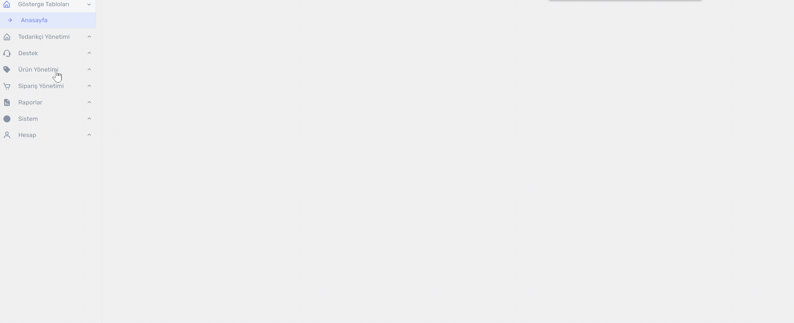
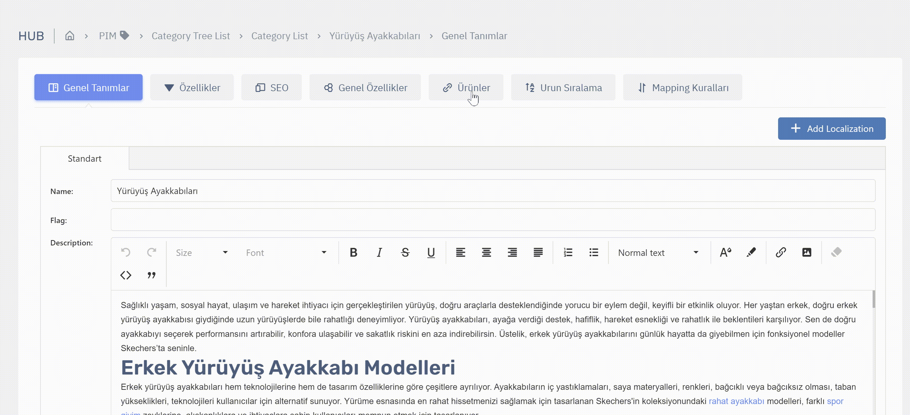
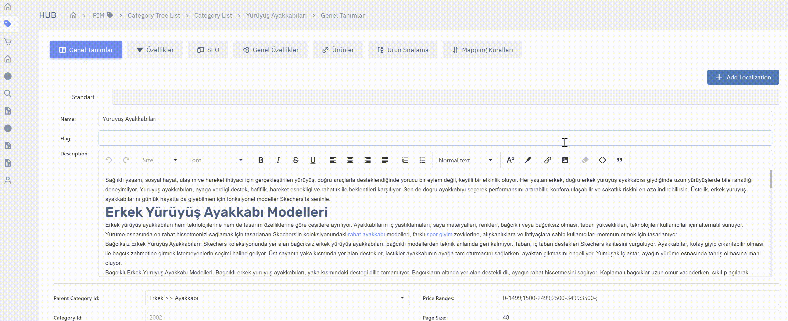

# Ürün Yönetimi > Kategori Yönetimi

## Kategori Yönetimine Giriş

Kategori Yönetimine  sol menüden  `Ürün Yönetimi > Kategori Ağaçları` menüsünden ulaşabilirsiniz. Burada yeni kategoriler oluşturabilir, listeleyebilir ve olan kategorileri düzenleyebilirsiniz.

## Kategori Yönetiminde hangi işlemler yapılabilir?
Kategori Yönetiminde bir çok işlem vardır. Her işlemin detayını başlıklar halinde bu dökümanda görebilirsiniz. 
## Yeni kategori nasıl yaratılır?
## Kategorinin detayına nasıl girilir?
* Kategori Ağaçları sayfasına girdikten sonra öncelikle bir kategori ağacı seçin.
* Sonraki sayfada tüm kategorilerinizi bir ağaç yapısında göreceksiniz. Burada kategori isimlerinin solundaki + ve - butonlarına tıklayarak alt kategorileri görebilirsiniz.
* Detayına girmek istediğiniz kategorinin üstüne tıklayın ve aşağıda bulunan `Devam Et` butonuna basarak detay sayfasına giriş yapın.

## Kategorinin temel bilgilerini yönetme
## Kategorinin seo bilgilerini yönetme
## Kategoriye manuel ürün sıralaması yapma
## Kategoriye manuel ürün bağlama / ürün ekleme , çıkarma
* Kategori detay sayfasına giriş yaptıktan sonra `Ürünler` sekmesine tıklayın.
* Burada kategoriye bağlı tüm ürünleri göreceksiniz. yanlarında yazan Manuel ve Auto ifadeleri ürünlerin kurallamı bağlandığı yoksa manuel mi bağlandığını gösterir.
* Otomatik bağlanan ürünleri buradan silemezsiniz. Bağlantıyı koparmak için kuralları değiştirebilirsiniz veya kuala uyan ürünün özelliklerini değiştirebilirsiniz.
* Manuel olarak kategoriye ürün bağlamak için + butonuna basarak ürünleri seçtikten sonra kaydet ikonlu butona basın. 
* İşlemleri tamamlmak için aşağıdaki `Değişiklikleri Kaydet` butonuna basın.

## Kategoriye otomatik ürün bağlama kurallarını yönetme (Mapping kuralları)
* Kategori detay sayfasına giriş yaptıktan sonra `Mapping Kuralları` sekmesine tıklayın.
* Açılan sekmede `Ekle` butonuna basın.
* Açılan pencerede eklemek istediğiniz ürünlerin özellikleri listelenecektir. Bu kategoriye hangi özellikli ürünlerin otomatik olarak bağlanmasını istiyorsanız o özellikleri doldurun. boş bırakılan özellikler ne olursa olsun buraya bağlanır anlamına gelir.
    * Örneğin ;
    * `Gender = MENS ProductType = FOOTWEAR SubProductType = Yürüyüş Ayakkabısı` kuralı; cinsiyeti erkek ve ürün tipi ayakkabı ve alt tipi yürüyüş ayakkabısı olan ürünler buraya bağlansın.
    * Örneğin bu kuralı şu şekilde ekleseydik `Gender = MENS` cinsiyeti erkek olan tüm ürünler bu kategoriye bağlanacaktı.
    * Örneğin üstteki kural ekli ve bir kural daha ekliyoruz `Gender = WOMENS`. bunuda eklersek tüm erkek ve tüm kadın ürünleri bu kategoriye eklenecekti. 
* Eklenmiş kuralı silmek isterseniz, kuralın sağındaki silme işaretli butona basın.
* Olan kuralı düzenlemek için kuralın sağındaki düzenleme işaretli butona basın.
### ***Kuralları gireceğiniz özelliklerin ayarlanması için commercelab ile iletişime geçiniz.***

## Kategorinin dinamik özelliklerini yönetme
## Kategorinin özellik setlerini yönetme
