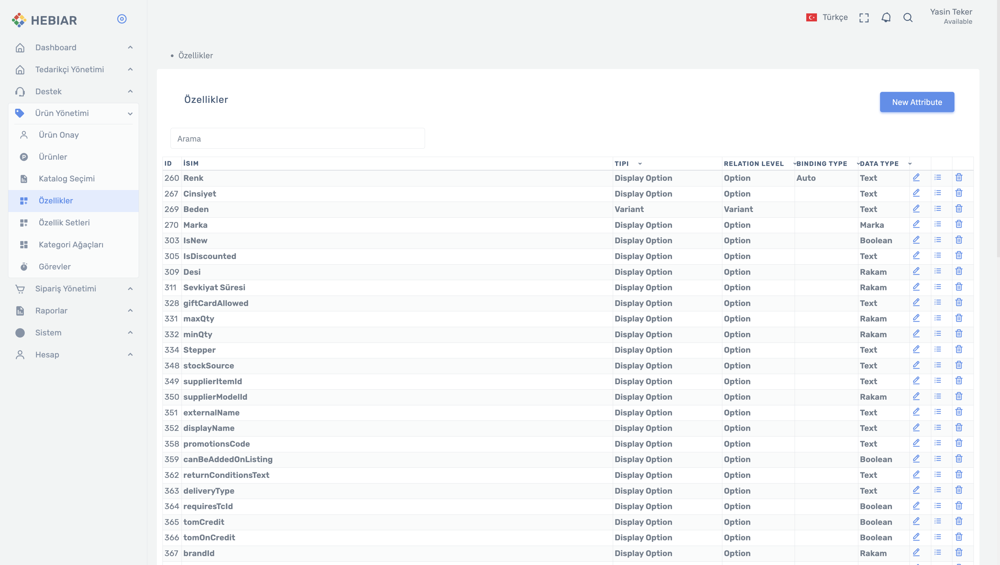

# Ürün Yönetimi > Özellikler

## Attribute Giriş

Attribute'larla ilgili işlemleri Ürün Yönetimi tabı altındaki sekmelerden yönetilir. 

* Attribute ayarları PIM'de 3 ayrı sekme üzerinden yapılır: Attributes, Attribute Set, Attribute Data Type.
* Attribute listesine sol menüden `Ürün Yönetimi > Özellikler` linkine tıklayarak ulaşabilirsiniz.

  
* Bu ekranda mevcutta varolan tüm attributelar listelenir.
* Attribute listeleme ekranında yeni attribute ekleme, düzenleme, değer ekleme, silme işlemleri gerçekleştirilebilir.

## Attribute Arama

İşlem yapılmak istenilen attribute'u liste üzerinden seçebilir veya search alanı ile arayabilirsiniz. 

## Yeni Attribute Yaratma

Yeni  bir attribute eklemek için bu ekrandan işlem gerçekleştirilebilir. 

* Sağ üst köşede bulunan `New Attribute` butonuna tıklanır.
* Açılan pop-up'ta yer alan bilgiler doldurularak yeni attribute ekleme işlemi gerçekleştirilir.

* Yeni bir attribute yaratırken doldurulması gereken alanlar:
*   `İsim` (Zorunlu Alan) Attribute için vereceğiniz isimdir. 
*   `Data Type` (Zorunlu Alan) Attribute'a vereceğiniz değerin data tipidir. 
*   `Açıklama` Açıklama alanıdır. 
*   `Tipi` (Zorunlu Alan) 
*   `Relation Level` (Zorunlu Alan)
*   `Binding Type` (Zorunlu Alan)
*   `Valid Start Date` 
*   `Valid End Date`
*   `Attribute Domain`
*   `Default Value`
*   `Validation Recursion`
*   `Validation Duration Unit`
*   `Validation Duration`

## Attribute'a Değer Ekleme 

Yeni oluşturulan attribute üzerine değer eklemek için yine `Ürün Yönetimi > Özellikler` ekranı kullanılır. 

* Değer eklemek için attribute listemele ekranına girilir.
* Listeden ilgili attribute seçilerek düzenle butonuna basılır.
* Buradan o attribute ile ilgili değerler attribute üzerine girilir.
* Ürünlere eklenecek olan attribute'larda verilecek değerler bu alanda girilmelidir.
* Bu ekranda eklenen değerler ürün üzerine attribute eklerken gelir.

## Attribute Silme

Attribute silmek için `Ürün Yönetimi > Özellikler` ekranı kullanılır. 

* İlgili attribute listeden bulunur.
* Listeleme ekranında attribute'un yanında yer alan `Çöp Kovası` işaretine tıklanarak attribute silme işlemi gerçekleştirilir.

## Attribute Set 

Attribute'leri yönetirken gruplandırmak istenirse attribute set yaratılabilir. Attribute setleri yönetmek için `Ürün Yönetimi > Özellik Setleri` ekranı kullanılır. 

* Attributeler oluşturulacak olan attribute setler ile gruplanır.
* Ürünlere ve kategorilere attribute setler atanabilir.
* Attribute setler üzerinde bulunan attributelara default değerler atanabilir.

## Attribute Set Yaratma 

Yeni  bir attribute eklemek için `Ürün Yönetimi > Özellik Setleri` ekranından işlem gerçekleştirilebilir. 

* Sağ üst köşede bulunan `New Attribute Set` butonuna tıklanır.
* `Name` alanından attribute set'e bir isim tanımlanır.
* `+Add Attribute` butonuna tıklanarak varolan attributelardan, bu attribute setin içine ekleme yapılır. Daha önce eklenmemiş herhangi bir attribute burada eklenemez.
* Eklenen attribute'a `Default Value` alanında default bir değer tanımlanabilir.

## Kateogoriye Attribute Set Ekleme 

Herhangi bir kategoriye veya koleksiyona attribute set eklenebilir. Kategoriye eklenen attribute set, kategori üzerindeki tüm ürünler için geçerli olacaktır. 

* `Ürün Yönetimi > Kategori Ağaçları > x Kategori Tree` adımları izlenerek kategori detaya girilir.
* Buradan attribute set eklenmek istenen kategori seçilir ve `Devam Et`e tıklanır.
* Kategori detayda `Özellikler` tabı seçilir.
* Sağ üst köşede yer alan `+` butonu tıklanarak kategoriye Attribute Set ekleme işlemi gerçekleştirilir.
  

  
