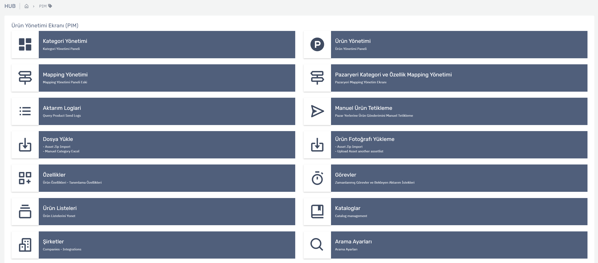

# Ürün Yönetimi  (Pim)

## Ürün Yönetimine Giriş

Ürün Bilgi Yönetim Sistemi anlamına gelen PIM(Product Information Management), ürün bilgisini toplama ve yönetmenin yanı sıra bu bilginin e-ticaret, pazar yerleri ve satış kanallarına dağılımını da sağlayan bir yönetim sürecidir.Ürünün kullanım ve teknik bilgisini etkin bir şekilde yöneterek ve zenginleştirerek süreç verimliliğini arttırmaya yardımcı olur.

