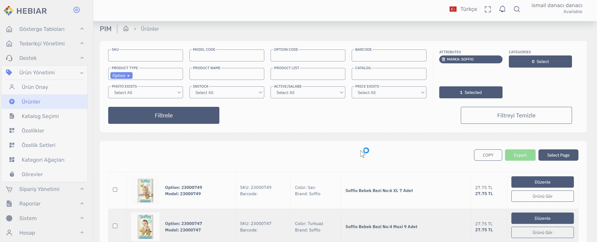
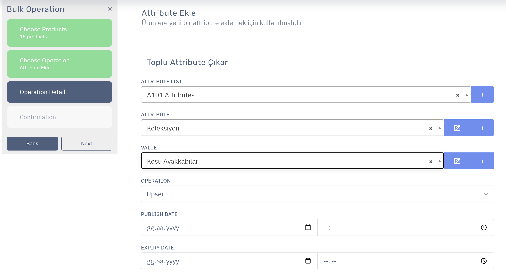
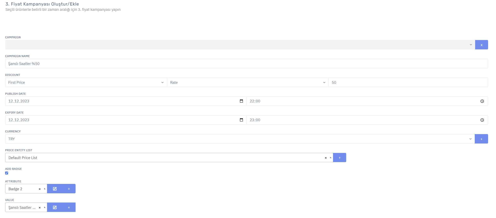

# Ürün Yönetimi > Ürün Listesi > Toplu İşlemler

## Toplu İşlemler Giriş

Toplu işlemleri yapmak için önce ürün listesine girip işlem yapmak istediğiniz ürün listesini seçmelisiniz.

* Ürün listesine sol menüden `Ürün Yönetimi > Ürünler` linkine tıklayarak ulaşabilirsiniz.
* Ürün listesine girdikten sonra seçmek istediğiniz ürünleri bulun. Ürünleri bulmak için [Detaylı Arama Yapma / Ürünleri Bulma](ProductList-Search.md) dökümanından faydalanabilirsiniz.
* Listeleme yaptıktan sonra ürünlerin solundaki seçim kutusuna tıklayarak tek tek ürünleri seçebilirsiniz.
* Filtre sonucunun tamamını seçmek istiyorsanız `Select All (Tümünü Seç)` butonuna basın.
* Sadece o safyada gözüken ürünleri seçmek istiyorsanız `Select Page (Sayfayı Seç)` butonuna basın.
* Seçili ürünler için seçilmiş ürünleri temsil eden `Seçilmiş Elemanlar (Selected Elements)` butonuna tıklayın.
* Sonrasında işlem yapmak istediğiniz ürünlerin önizlemesi gelecektir. Kontrolünüzü tamamladıktan sonra `Next (İleri)` butonuna basın.
* Bir sonraki sayfada yapmak istediğiniz işlemin seçim ekranı gelecektir. Buradan yapmak istediğiniz işlemi seçin.
* Seçim sonrası o işleme özel sonraki ekranda ilgili işlemi yaparak toplu işlemi tamamlayabilirsiniz.

## Toplu olarak hangi işlemler yapılabilir?
Toplu işlemler arasında bir çok işlem vardır. Her işlemin detayını başlıklar halinde bu dökümanda görebilirsiniz. 
## Satış Durumunu Güncelleme
Ürünlerin satış durumunu toplu olarak bu seçenek altından güncelleyebilirsiniz. 
* Ürün seçimlerini tamamlayıp toplu işlemlere girdikten sonra (bu dökümanda seçim ve menüye giriş anlatılmıştır.) `Satış durumu güncelle` seçeneğine tıklayarak soldaki `Next (İleri)` butonuna basın. 
* Gelen Akran üzerinden satış durumunu güncellemek istediğiniz satış kanallarının karşısındaki seçenekler üzerinden `Satışa Aç` veya `Satışa Kapat` seçeneklerini Seçin. Eğer kaynaktan gelen satış durumunu güncellemek istemiyorsanız seçimi değiştirmeyin.
* Eğer satış durumunu belli bir tarih/saat aralığında yapmak istiyorsanız başlangıç bitiş tarihlerini seçin , istemiyorsanız boş bırakın ve `Next (İleri)` butonuna basın.
* Bir sonraki ekranda işlemin özeti çıkacaktır. İşleminizi son bir kontrol yaptıktan sonra  `Next (İleri)` butonuna basarak işleminizi tamamlayın.
## Attribute (Özellik) Ekleme 
* Ürün seçimlerini tamamlayıp toplu işlemlere girdikten sonra (bu dökümanda seçim ve menüye giriş anlatılmıştır.) `Attribute Ekle` seçeneğine tıklayarak soldaki `Next (İleri)` butonuna basın. 
* Sonraki ekranda ürünlere eklemek istediğiniz özelliği  seçin. Seçim sonrası açılan özellik değerleri listesinden ürünlere eklemek istediğiniz özellik değerini seçin ve soldaki `Next (İleri)` butonuna basın. 
* Bir sonraki ekranda işlemin özeti çıkacaktır. İşleminizi son bir kontrol yaptıktan sonra  `Next (İleri)` butonuna basarak işleminizi tamamlayın.

## Attribute (Özellik) Çıkarma 
* Ürün seçimlerini tamamlayıp toplu işlemlere girdikten sonra (bu dökümanda seçim ve menüye giriş anlatılmıştır.) `Attribute Çıkar` seçeneğine tıklayarak soldaki `Next (İleri)` butonuna basın. 
* Sonraki ekranda ürünlerden çıkarmak istediğiniz özelliği  seçin. Seçim sonrası açılan özellik değerleri listesinden ürünlerden çıkarmak istediğiniz özellik değerini seçin ve soldaki `Next (İleri)` butonuna basın. 
* Bir sonraki ekranda işlemin özeti çıkacaktır. İşleminizi son bir kontrol yaptıktan sonra  `Next (İleri)` butonuna basarak işleminizi tamamlayın.

## Kategori Ekleme
* Ürün seçimlerini tamamlayıp toplu işlemlere girdikten sonra (bu dökümanda seçim ve menüye giriş anlatılmıştır.) `Kategoriye Ekle` seçeneğine tıklayarak soldaki `Next (İleri)` butonuna basın. 
* Sonraki ekranda ürünleri eklemek istediğiniz kategori ağacını seçin. Seçim sonrası açılan kategori listesinden ürünleri eklemek istediğiniz kategoriyi seçin ve soldaki `Next (İleri)` butonuna basın. 
* Bir sonraki ekranda işlemin özeti çıkacaktır. İşleminizi son bir kontrol yaptıktan sonra  `Next (İleri)` butonuna basarak işleminizi tamamlayın.

## Kategoriden Çıkarma 
* Ürün seçimlerini tamamlayıp toplu işlemlere girdikten sonra (bu dökümanda seçim ve menüye giriş anlatılmıştır.) `Kategoriden Çıkar` seçeneğine tıklayarak soldaki `Next (İleri)` butonuna basın. 
* Sonraki ekranda ürünleri çıkarmak istediğiniz kategori ağacını seçin. Seçim sonrası açılan kategori listesinden ürünleri çıkarmak istediğiniz kategoriyi seçin ve soldaki `Next (İleri)` butonuna basın. 
* Bir sonraki ekranda işlemin özeti çıkacaktır. İşleminizi son bir kontrol yaptıktan sonra  `Next (İleri)` butonuna basarak işleminizi tamamlayın.

## Excel Export (Ürünleri excele aktarma)
* Ürün seçimlerini tamamlayıp toplu işlemlere girdikten sonra (bu dökümanda seçim ve menüye giriş anlatılmıştır.) `Excel Export` seçeneğine tıklayarak soldaki `Next (İleri)` butonuna basın. 
* Bir sonraki ekranda işlemin özeti çıkacaktır. İşleminizi son bir kontrol yaptıktan sonra  `Next (İleri)` butonuna basarak işleminizi tamamlayın.
## 3. Fiyat Kampanyası Oluştur/Ekle
* Ürün seçimlerini tamamlayıp toplu işlemlere girdikten sonra (bu dökümanda seçim ve menüye giriş anlatılmıştır.) `3. Fiyat Kampanyası Oluştur/Ekle` seçeneğine tıklayarak soldaki `Next (İleri)` butonuna basın. 
* Sonraki ekranda ürünlere uygulamak istediğiniz kampanyayı seçin veya yeni kampanya ekleyin ve soldaki `Next (İleri)` butonuna basın. 
    * Kampanyanın yanı sıra bu kampanya ile birlikte ürünler üzerinde gösterilecek bir Badge (ürün üzerine konulacak bir küçük görsel/yazı/stil) de seçebilirsiniz.
    * Kampanyada yüzdelik yada düz fiyat indirimi ypabilirsiniz. 
* Bir sonraki ekranda işlemin özeti çıkacaktır. İşleminizi son bir kontrol yaptıktan sonra  `Next (İleri)` butonuna basarak işleminizi tamamlayın.

 