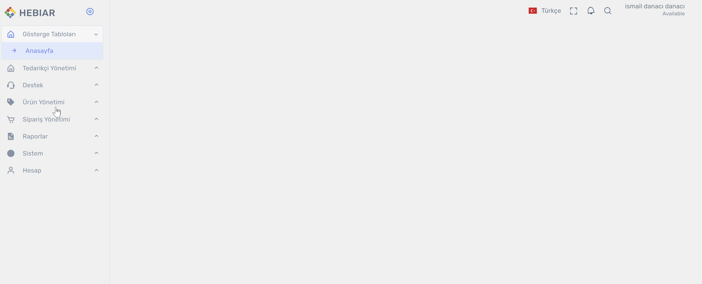
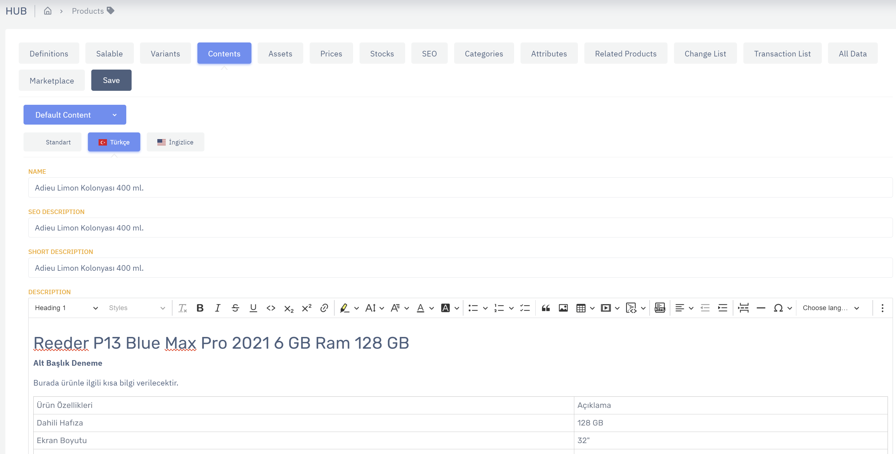
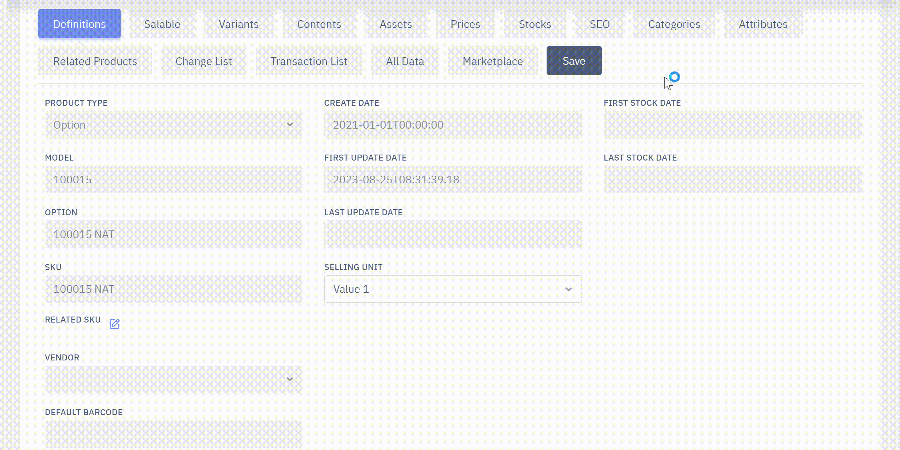

# Ürün Yönetimi > Ürün Detay

## Ürün Detaya Giriş

Ürün Detay üzeride ürünün tüm bileşenlerini görüntüleyebilir ve düzenleyebilirsiniz.

* Ürün Detaya sol menüden `Ürün Yönetimi > Ürünler` linkine tıklayarak aramak istediğiniz ürün bilgilerini filtrelerden seçip `Filtrele` butonuna bastıktan sonra istediğiniz ürünün yanındaki `Düzenle` butonuna basarak ulaşabilirsiniz.
    

##  Ürün Detayda Yapılabilir İşlemler 

Ürün detayda ürünle ilgili birçok düzenleme yapılabilir. 

`Definitons` : Bu alanda ürünle ilgili genel bilgiler yer alır. SKU, Product Type, Barkod gibi alanlar burada görüntülenir. 

`Salable` 

`Variants`

`Contents`: Bu alanda, Name, Title, Seo Description, Short Description ve Description alanları düzenlenebilir.

`Assets`

`Prices`

`Stocks`

`SEO`

`Categories`

`Attributes`

`Related Products`

`Change Lists`

`Transaction List`

`All Data`

`Save`

# Satış durumunu güncelleme (Satışa Açmak,Satışa Kapatmak)

Ürünün satışa açılması ve satışa kapanması ile ilgili ayarlar ürün özelinde bu sekmede yapılır.

* Topluca ürün açma/kapama yapılmak istenirse `Toplu Ürün İşlemleri` sekmesinden, `Satış Durumunu Güncelle` adımı ile işlem gerçekleştirilebilir. 
* `https://docs.test.hebiar.com/tr/comlab/latest/Hub/Pim/ProductList-Bulk` bağlantısından toplu ürün açma/kapama işlemleri gerçekleştirilir.
 

# Fotoğraf,Video ekleme, silme, sırasını değiştirme

Ürün görselleri bu alandan yönetilebilir. 

* Ürün üzerindeki mevcut assetler bu alanda listelenir.
* Assetlerin sol tarafında yer alan `çift taraflı ok` ile assetlerin sırası düzenlenir.
  
* `+Add New Asset` butonuna tıklanarak yeni asset eklenebilir.
* Buradan fotoğraf, video veya gif eklenebilir.

Ayrıca toplu işlemlerle topluca ürünlere yüklenebilir. Ürünlere video ekleme işlemleri buradan yapılır. 

# Attribute görüntüleme, ekleme çıkarma 

Ürün üzerinde yer alan attributeler `Attributes` sekmesinde listelenelir. 

* Ürüne yeni bir attribute değeri eklenmek istendiğinde `+ Add Attribute` butonuna tıklanır.
* Sağ tarafta `Maps` başlığı altında ürüne eklenebilecek attributelerin bir listesi çıkar.
* Buradan eklenmek istenen attribute başlığı `Seç` butonuna basılarak seçilir.
* Attribute seçildikten sonra eklenecek değerler listelenir. Buradaki değerler daha önce attribute ayarlarından ilgili attribute'a eklenmiş olan değerlerdir.
* Attribute'a atanmak istenen değer seçilir ve `Seç` butonuna basılarak seçilir.
* `Kaydet` butonuna basılarak eklenen düzenlemeler kaydedilir. 
  
  
# Kategori görüntüleme, ekleme, çıkarma 
* Ürün detay sayfasındaki `Kategoriler` sekmesine geldikten sonra `Kategori Ekle` butonuna basarak sağ tarafta çıkan kategori listesinden ilgili kategoriyi seçerek `Ekle` butonuna basarak ekleme işleminizi yapın.
* Ekleme işlemini yaptıktan sonra değişikliği kaydetmek için `Save (Kaydet)` butonuna basarak işlemi tamamlayabilirsiniz.

# Bağlantılı ürünleri düzenleme
* Bundle ürün içeriği düzenleme
* Genel Öneri ürün düzenleme
* Satış Öncesi Öneri ürün düzenleme
* Satış Sonrası Öneri ürün düzenleme
