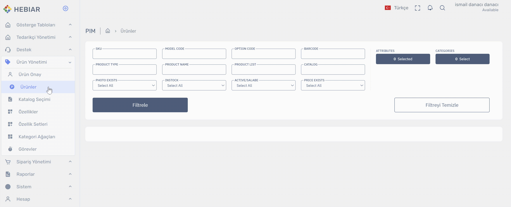
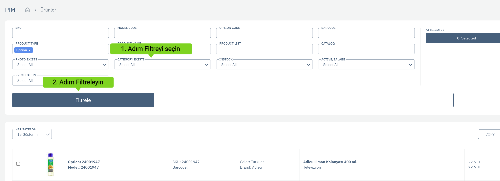

# Ürün Yönetimi > Ürün Listesi

## Ürün Listesi Giriş

Ürün Listesinde buraya dahil olan tüm ürünleri bulabilir, detayını görütüleyebilir , toplu yada tekil olarak işlemler yapabilirsiniz.

* Ürün listesine sol menüden `Ürün Yönetimi > Ürünler` linkine tıklayarak ulaşabilirsiniz.

## Ürün Listesinde Arama Yapma

Ürün listesinde ürünün bir çok özelliği üzerinden arama yaparak bulmak istediğiniz ürünleri listeleyebilirsiniz.

### Ürün Özelliğinden Arama yapma 
Ürün listesinde bulunan Attributes (Özellik) kısmına tıklayarak çıkan popup (pencere) üzerinden önce aramak  istediğiniz özelliği seçip sonrasında özelliğin değerlerinden seçerek Filtrele butonuna bastıktan sonra seçtiğiniz özelliklere sahip ürünler listelenecektir.  
    

### Kategorisi olmayan ürünleri bulma / filtreleme
Ürün listesinde bulunan `CATEGORY EXISTS (Kategoriye sahip)` filtresi üzerinden hiç bir kategoriye bağlanmamış ürünleri filtreleyebilirsiniz. Değer olarak `Not Exists` seçilmelidir. Herhangi bir kategoriye bağlı ürünleri ise `Exists` seçeneğini seçerek bulabilirsiniz.

