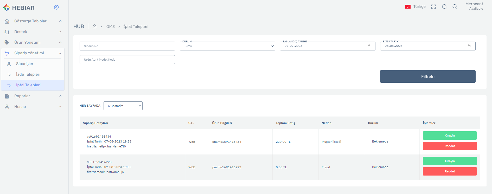

# Sipariş Kalemi İptal Etme İsteği API Dökümantasyonu

Bu dökümantasyon, sipariş kalemlerini iptal etme isteği API'sini açıklar. Bu API, sipariş kalemi iptal işlemlerini gerçekleştirmenize olanak tanır.

## API Endpoint

API, aşağıdaki endpoint'i kullanır:

```plaintext
POST https://api.oms.prod.hebiar.com/Orders/CreateOrderItemLineCancelRequest
```

## Yetkilendirme

API'ye erişim sağlamak için aşağıdaki yetkilendirme başlığını kullanmanız gerekmektedir:

```
Authorization: Bearer ...
```

## İstek Başlıkları

- `accept`: İstekte kabul edilebilir medya türünü belirtir (örn. text/plain).
- `Content-Type`: İstekte gönderilen içeriğin medya türünü belirtir (örn. application/json).

## İstek Verileri

Aşağıdaki örnek, API'ye gönderilecek istek verilerini gösterir:

```json
[
  {
    "sourceOrderItemLineId": "item1691416223190-1",
    "quantity": 1,
    "reasonId": 137,
    "reasonDesc": "sebep açıklaması"
  }
]
```

- `sourceOrderItemLineId`: Kaynak sipariş kalemi kimliği.
- `quantity`: İptal edilecek ürün miktarı.
- `reasonId`: İptal sebebi kimliği.  > [reasonId bilgisini bu apiden alabilirsiniz](GetReasonsByStatus.md)
- `reasonDesc`: İptal sebebi açıklaması.

## İstek Örneği

Aşağıdaki örnek, API'ye istek yapmanın bir örneğini gösterir:

```bash
curl --location 'https://api.oms.prod.hebiar.com/Orders/CreateOrderItemLineCancelRequest' 
--header 'accept: text/plain' 
--header 'Authorization: Bearer ...' 
--header 'Content-Type: application/json' 
--data '[
  {
    "sourceOrderItemLineId": "item1691416223190-1",
    "quantity": 1,
    "reasonId": 137,
    "reasonDesc": "sebep açıklaması"
  }
]'
```

## Dönüş

API isteğine verilen dönüş aşağıdaki gibidir:

```json
{
    "isSuccess": true,
    "statusCode": 200
}
```

- `isSuccess`: İstek başarılı ise true, aksi halde false.
- `statusCode`: İstek durum kodu.


## Hub Arayüz
- İptal istekleri ilgili satıcının İptal talepleri sayfasına düşmekte ve satıcı bunları onay yada reddederse operatöre webhook ([örneklere buradan ulaşabilirsiniz ](../WhatIsWebHook.md)) ile iletilmektedir.


    