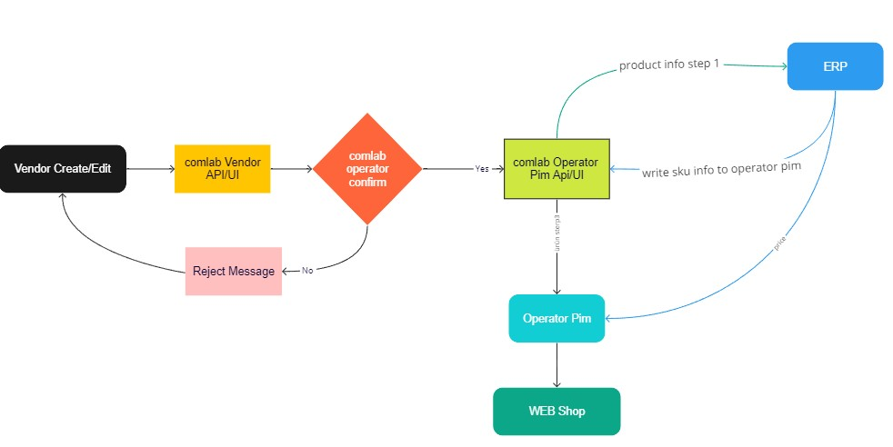

# Onaylanan satıcı ürününe sku kaydetme 



# Api

Method:`POST`

Security:`Basic Auth` 

URL:`{path_the_comlab_pim_api}/pim/SaveExternalSku`

Request Body:
```json
[
   {
      "VendorCode":"Tiamob",
      "Sku":"S1-STK-xxtesss",
      "ExternalCode":"SAP-TEST1-CODE",
      "ExternalBarcode":"SAP-TEST1-BARCODE"
   },
   {
      "VendorCode":"Tiamob",
      "Sku":"S1-STK-xxtes",
      "ExternalCode":"SAP-TEST2-CODE",
      "ExternalBarcode":"SAP-TEST2-BARCODE"
   }
]

```
POSTMAN / Curl
```sh
curl --location '{path_the_comlab_pim_api}/pim/SaveExternalSku' \
--header 'Content-Type: application/json' \
--header 'Authorization: Basic base64str' \
--data '[
   {
      "VendorCode":"Tiamob",
      "Sku":"S1-STK-xxtesss",
      "ExternalCode":"SAP-TEST1-CODE",
      "ExternalBarcode":"SAP-TEST1-BARCODE"
   },
   {
      "VendorCode":"Tiamob",
      "Sku":"S1-STK-xxtes",
      "ExternalCode":"SAP-TEST2-CODE",
      "ExternalBarcode":"SAP-TEST2-BARCODE"
   }
]'
```
> Result
```json
true
```


