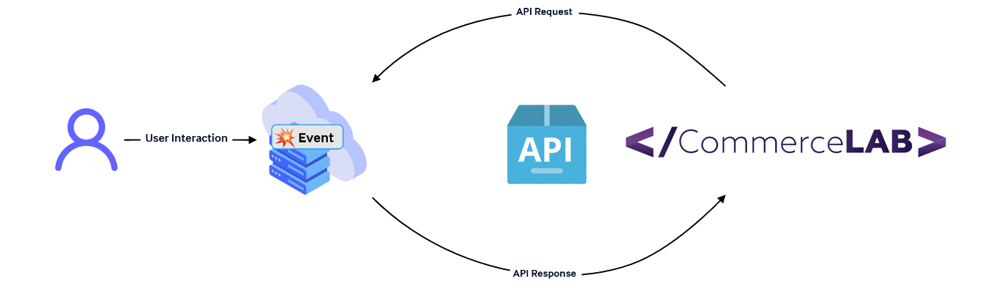

# Web Hook 

## Web Hook Nedir?

Belirli bir olay meydana geldiğinde bir uygulamadan diğerine gerçek zamanlı veri göndermenizi sağlar. 

## Hookta Request ve Response 

Gönderilen veriyi karşı tarafın alabilmesi için alıcının gönderilen modeli kabul edebiliyor olması gerekmektedir. Mesajın düzgün iletilip iletilmediğini anlamak için alıcı üzerinde anlaşılan dönüşü bekler.

## Güvenlik için authentication yöntemleri

Güvenlik konusunda önerdiğimiz ve desteklediğimiz 3 yöntem vardır. 

* URL in tahmin elimez olması (örneğin bir guid kadar karmaşık olabilecek bir api urli olmalıdır. http://sample.com/webhook/cancel-hook-b2df951c-2eff-49c6-8b5b-45fd5e1c4b29)
* Basic Auth 
* Bearer Token

## Örnek Hook Apileri

Tam olarak nasıl apiler yazılması gerektiğini örnek apiler üzerinde görebilirsiniz. Aynı apileri yazpı url ve doğrulama tipini belirttiğinizde ilgili event sizlere gönderiliyor olacaktır.

* Sipariş
    * Gönderi Paketi (Teslimat) Hook Örnekleri
        * [Gönderi paketinin güncelleme bildirimleri](Oms/PackageUpdateWebHook.md)
        * [İptal İstedğinin Reddedilmesi](Oms/CancelRequestRejectedUpdateWebHook.md)
        * [İptal İstedğinin Onaylanması](Oms/CancelRequestConfirmedUpdateWebHook.md)
    * İade Webhook Örnekleri
        * [İade paketinin durum güncellemeleri](Oms/ReturnRequestStatusUpdateWebHook.md)
        * [İade paketinin onaylanması](Oms/ReturnRequestConfirmedWebHook.md)    
        * [İade paketinin reddedilmesi](Oms/ReturnRequestRejectedUpdateWebHook.md)    
* Ürün
    * Kategori aktarımı
    * Attribute Aktarımı
    * Ürün Akatarımı
    * Stok aktarımı
    * Fiyat aktarımı

